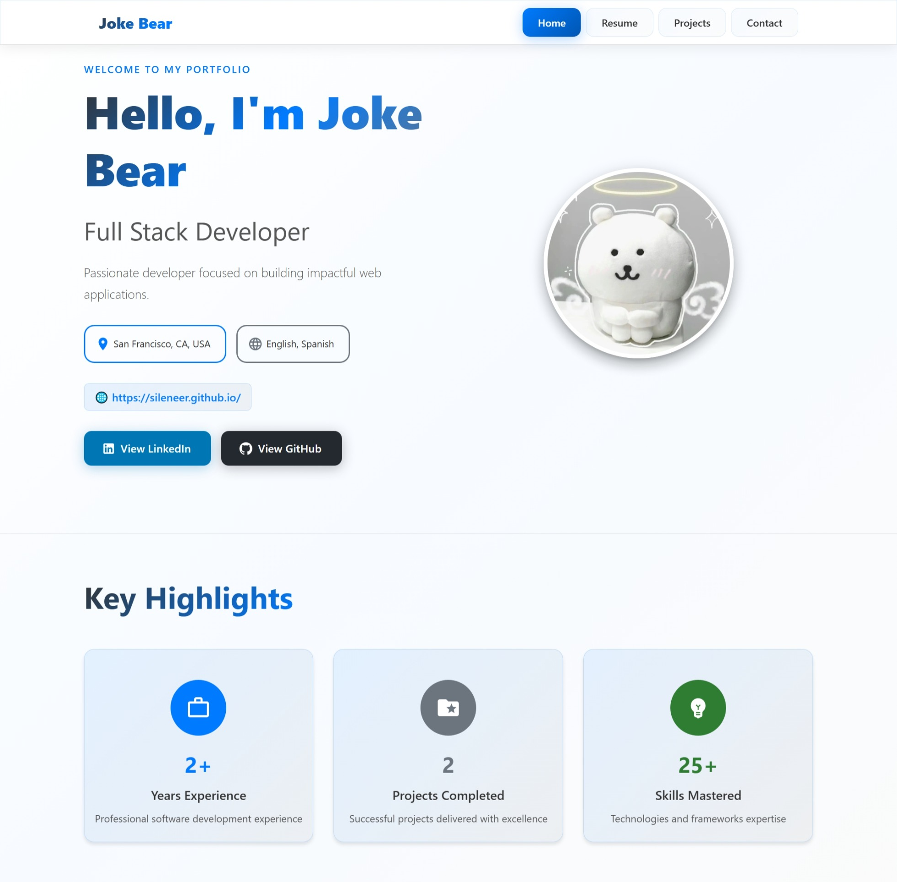

# Awesome Portfolio Page React

🚀 A modern, customizable React template for developer portfolios. Built with React and **Material-UI (@mui/material)** featuring a clean, professional design with multiple sections to showcase your skills, experience, and projects.



## ✨ Features

- **🎨 Material-UI Design**: Professional Material Design components with consistent theming
- **📱 Responsive Design**: Built-in responsive breakpoints for all device sizes
- **🏠 Home Page**: Professional landing page with hero section and highlight cards
- **📄 Resume Section**: Complete professional background with structured experience, education, and skills
- **💼 Projects Showcase**: Showcase projects with Material-UI cards, chips, and media components
- **📞 Contact Page**: Multiple contact methods with icons and professional styling
- **� Theme System**: Centralized Material-UI theme with custom color palette
- **♿ Accessible**: Built-in accessibility features and ARIA attributes
- **⚙️ Fully Customizable**: All content driven by a single JSON configuration file
- **🔒 Data Validation**: Structured data format ensures consistency and prevents errors

## 🎨 Material-UI Implementation

This portfolio has been completely rewritten using Material-UI components:

### Key Components Used
- **Layout**: `Container`, `Grid`, `Box` for responsive layouts
- **Navigation**: `AppBar`, `Toolbar` with Material Design principles
- **Content**: `Card`, `CardContent`, `Paper` for elevated content sections
- **Typography**: Consistent text hierarchy with Material-UI typography system
- **Interactive**: `Button`, `IconButton`, `Chip` components with built-in ripple effects
- **Media**: `Avatar`, `CardMedia` for images with proper aspect ratios
- **Icons**: `@mui/icons-material` for professional vector icons

### Theme Features
- Custom color palette maintaining professional appearance
- Responsive typography that scales with screen size
- Component style overrides for consistent branding
- Material Design elevation system for depth

## 🚀 Quick Start

### Installation

1. **Clone the repository**:
   ```bash
   git clone https://github.com/sileneer/awesome-portfolio-page-react.git
   cd awesome-portfolio-page-react
   ```

2. **Install dependencies**:
   ```bash
   npm install
   ```

3. **Start the development server**:
   ```bash
   npm start
   ```

4. **Open your browser** and visit [http://localhost:3000](http://localhost:3000)

### Customization

Your portfolio data is organized into separate JSON files for easy management:

1. **Personal Information**: Edit `src/data/user/personalInfo.json`
   - Update your name, title, bio, contact info, and social links
   
2. **Navigation**: Edit `src/data/core/navigation.json`
   - Customize your brand name and menu items

3. **Resume**: Edit `src/data/user/resume.json`
   - Add work experience, education, skills, certifications, and awards

4. **Projects**: Edit `src/data/user/projects.json`
   - Showcase your portfolio projects with descriptions and screenshots

5. **Contact**: Edit `src/data/user/contact.json`
   - Add additional contact methods and social media links

6. **Images**:
   - Add your profile photo to `public/profile_photo.png`
   - Add your CV to `public/CV.pdf` (optional)
   - Add project screenshots to `public/projects/` folder (optional)

See [PORTFOLIO_DATA_STRUCTURE.md](./docs/PORTFOLIO_DATA_STRUCTURE.md) for complete details on available fields and data structure.

## 📁 Project Structure

```
src/
├── components/
│   ├── Navigation.js          # Main navigation component
│   ├── Pages.js              # Page exports
│   └── pages/
│       ├── HomePage.js       # Landing page with hero section
│       ├── ResumePage.js     # Resume and experience
│       ├── ProjectsPage.js   # Projects showcase
│       └── ContactPage.js    # Contact information
├── data/
│   ├── core/
│   │   └── navigation.json   # Navigation menu configuration
│   └── user/
│       ├── personalInfo.json # Personal information and bio
│       ├── resume.json       # Professional experience and education
│       ├── projects.json     # Portfolio projects
│       └── contact.json      # Contact information and social links
└── App.js                    # Main app component with theme
```

## 🎨 Pages Overview

### Home Page
- Hero section with your photo, name, and professional title
- Quick overview of location, languages, and website
- Links to LinkedIn and GitHub
- Statistics cards showing experience, projects, and skills count

### Resume Page
- Professional summary
- Work experience with achievements and technologies
- Education background with coursework and activities
- Skills showcase with technology tags
- Certifications and awards
- Personal interests
- Downloadable CV link

### Projects Page
- Project cards with descriptions and technologies used
- Screenshots and live demo links
- Role and duration information
- Clean, organized layout for easy browsing

### Contact Page
- Multiple contact methods (email, phone, location)
- Social media links (LinkedIn, GitHub, Twitter, Facebook)
- Meeting scheduling integration (Calendly)
- Professional contact message

## 📋 Available Scripts

### Development
- **`npm start`** - Start development server at [http://localhost:3000](http://localhost:3000)
- **`npm test`** - Run tests in watch mode
- **`npm run build`** - Build for production (outputs to `build/` folder)

### Production Build
The production build is optimized and minified, ready for deployment to any static hosting service.

## 🚀 Deployment

This project can be deployed to various platforms:

### GitHub Pages
```bash
npm run build
# Deploy the build/ folder to your hosting service
```

### Netlify / Vercel
Simply connect your GitHub repository and these services will automatically build and deploy your portfolio.

### Other Static Hosting
Build the project (`npm run build`) and upload the `build/` folder contents to any static web hosting service.

## 🛠️ Customization Guide

### Basic Setup

#### 1. Personal Information (`src/data/user/personalInfo.json`)
Update your basic information:
- Name, title, and professional bio
- Contact details (email, phone, location)
- Social media links (LinkedIn, GitHub, website)
- Languages you speak
- Profile photo path

#### 2. Navigation (`src/data/core/navigation.json`)
Customize your navigation bar:
- Brand name or logo text
- Menu items and their routes

#### 3. Resume (`src/data/user/resume.json`)
Build your professional profile:
- Professional summary
- Work experience with achievements
- Education history
- Technical skills
- Certifications and awards
- Personal interests
- Downloadable CV link

#### 4. Projects (`src/data/user/projects.json`)
Showcase your work:
- Project name and description
- Technologies used
- Your role and project duration
- Screenshots and demo links

#### 5. Contact (`src/data/user/contact.json`)
Add additional contact options:
- Custom contact message
- Alternate email
- Social media (Twitter, Facebook)
- Meeting scheduler link (Calendly)

### Adding Images
- **Profile Photo**: Add your photo as `public/profile_photo.png`
- **CV File**: Add your resume PDF as `public/CV.pdf`
- **Project Screenshots**: Create `public/projects/` folder and add your project images

### Styling & Theming
The application uses Material-UI theming configured in `src/App.js`:
- **Theme Configuration**: Modify the `createTheme()` object in `App.js`
- **Color Palette**: Change primary, secondary, and background colors
- **Typography**: Adjust font families, sizes, and weights
- **Component Overrides**: Customize Material-UI component styles
- **Responsive Breakpoints**: Adjust mobile/tablet/desktop layouts

For detailed theme customization, see the Material-UI documentation: https://mui.com/material-ui/customization/theming/

## 🤝 Contributing

1. Fork the repository
2. Create a feature branch (`git checkout -b feature/amazing-feature`)
3. Commit your changes (`git commit -m 'Add some amazing feature'`)
4. Push to the branch (`git push origin feature/amazing-feature`)
5. Open a Pull Request

## 📝 License

This project is open source and available under the [MIT License](LICENSE).

## 🙏 Acknowledgments

- Built with [Create React App](https://github.com/facebook/create-react-app)
- Icons and design inspiration from modern portfolio trends
- Thank you to all contributors who help improve this template

---

**Ready to showcase your work?** Clone this repo and create your professional portfolio in minutes! ✨
